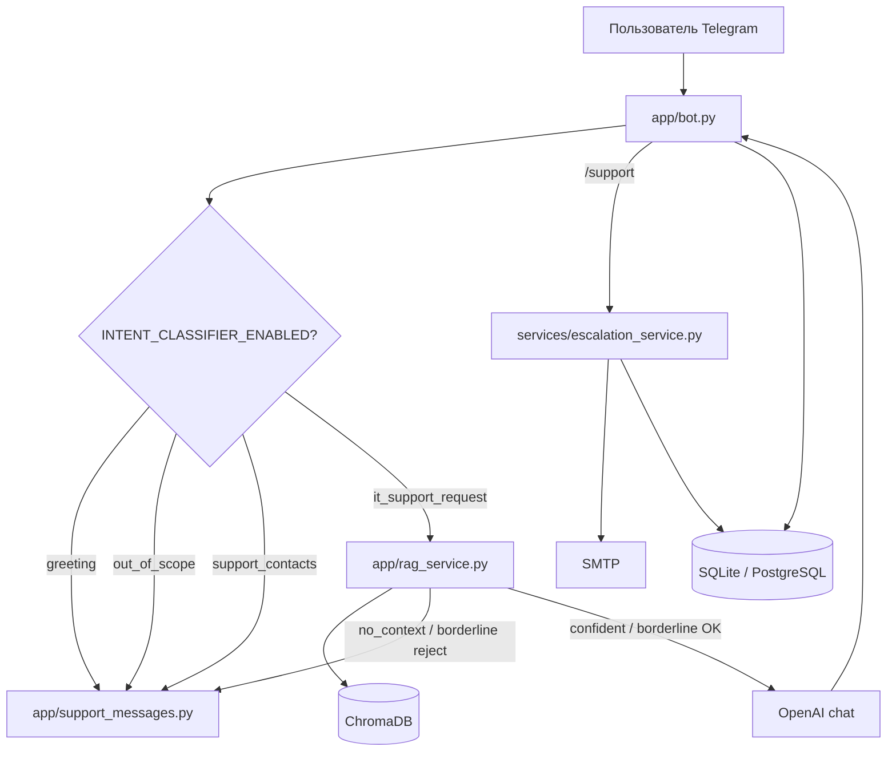

# GP-ITBot

Telegram-бот первой линии ИТ-поддержки с RAG по корпоративной базе знаний: OpenAI (ответы и эмбеддинги), ChromaDB, классификация намерений, двухуровневый отбор контекста и эскалация в поддержку по email.

## Возможности

- **RAG-ответы** по документам в `data/docs/` (txt, md, docx, pdf).
- **Классификатор намерений** перед RAG: приветствие, оффтоп, запрос контактов, ИТ-вопрос.
- **Двухпороговый отбор чанков** (`RAG_MIN_SCORE`, `RAG_CONFIDENT_SCORE`) и **groundedness-проверка** для пограничного контекста.
- **История диалога** в памяти (для уточняющих вопросов и эскалации).
- **Эскалация в поддержку** через `/support` или кнопку «Передать в поддержку» (SMTP + запись в БД логов).
- **Расширенное логирование**: файл `logs/runtime.log`, SQLite или PostgreSQL (`interactions`, `runtime_events`, `support_escalations`).
- **Маскирование секретов** в логах и перед отправкой в LLM.

## Стек

| Компонент | Технология |
|-----------|------------|
| Бот | Python 3.12, aiogram 3 |
| LLM / embeddings | OpenAI API |
| Векторное хранилище | ChromaDB (persistent) |
| Логи | SQLite (по умолчанию) или PostgreSQL |
| Контейнеризация | Docker, docker compose |

## Архитектура



### Поток RAG

1. Chroma возвращает top-k чанков (`TOP_K`).
2. Для каждого чанка: `relevance_score = 1 / (1 + distance)`.
3. Чанки с `relevance_score < RAG_MIN_SCORE` отбрасываются.
4. Если чанков не осталось → **no_context** → шаблон «не нашёл инструкцию».
5. Если `best_score >= RAG_CONFIDENT_SCORE` → **confident** → генерация ответа.
6. Если `RAG_MIN_SCORE <= best_score < RAG_CONFIDENT_SCORE` → **borderline** → LLM-проверка: есть ли в контексте прямой ответ (без опоры на общие знания модели).
7. При `has_direct_answer=false` → **no_context** (отдельный текст с рекомендацией `/support`).
8. Список источников добавляется к ответу программно (не из текста модели).

Пороги по умолчанию: `RAG_MIN_SCORE=0.35`, `RAG_CONFIDENT_SCORE=0.55`.

## Структура проекта

```text
gp-itbot/
├── app/
│   ├── bot.py              # Telegram-обработчики, маршрутизация
│   ├── rag_service.py      # Поиск, качество контекста, генерация ответа
│   ├── intent_service.py   # Классификация намерений
│   ├── support_messages.py # Шаблоны ответов пользователю
│   ├── config.py           # Настройки из .env
│   ├── prompt_loader.py    # Загрузка промптов (system — fail-fast)
│   ├── chat_history.py     # In-memory история диалога
│   └── logging_service.py  # interactions / runtime_events
├── services/
│   ├── escalation_service.py
│   └── email_notification_service.py
├── repositories/
│   └── support_escalation_repository.py
├── ingest/
│   ├── ingest_docs.py      # Индексация в Chroma
│   ├── document_profiler.py
│   ├── document_chunker.py
│   └── text_cleaner.py
├── prompts/
│   ├── system_prompt.md
│   ├── intent_classifier_prompt.md
│   └── document_profiler_prompt.md
├── data/docs/              # База знаний (исходники)
├── data/chroma/            # Индекс (volume в Docker)
├── scripts/                # Отладочные утилиты
├── tests/
├── docker-compose.yml
├── docker-compose.postgres.yml
└── .env.example
```

## Быстрый старт (Docker)

```bash
cp .env.example .env
# Заполнить TELEGRAM_BOT_TOKEN, OPENAI_API_KEY
# Для эскалации: SMTP_HOST, SMTP_USER, SMTP_PASSWORD, SMTP_FROM

docker compose up --build
```

После первого запуска проиндексируйте документы:

```bash
docker compose run --rm bot python ingest/ingest_docs.py
```

Проверка коллекции:

```bash
docker compose run --rm bot python scripts/check_chroma_collection.py
```

## Индексация документов

Положите файлы `txt`, `md`, `docx`, `pdf` в `data/docs/`.

По умолчанию ingest **пересоздаёт** коллекцию Chroma (`RECREATE_CHROMA_COLLECTION=true`), чтобы не оставались устаревшие чанки после смены документов или стратегии чанкинга. Для инкрементального режима:

```env
RECREATE_CHROMA_COLLECTION=false
```

### Document profiler (опционально)

При `DOCUMENT_PROFILER_ENABLED=true` перед чанкингом LLM определяет тип документа и стратегию разбиения (FAQ, instruction, policy, troubleshooting и т.д.). Параметры чанков задаются в `.env` (`*_CHUNK_MAX_TOKENS`, `*_CHUNK_OVERLAP_TOKENS`). Отчёт: `data/preprocessing_report.json`.

Проверка профайлера на одном файле:

```bash
python scripts/check_document_profiler.py data/docs/vpn_fortinet_setup.md
```

## Команды и интерфейс бота

| Команда / действие | Назначение |
|--------------------|------------|
| `/start` | Приветствие, сброс истории диалога |
| `/help` | Справка по командам и кнопкам |
| `/clear` | Очистить историю диалога |
| `/support` | Эскалация в ИТ-поддержку (подтверждение «Да, отправить» / «Нет») |
| Любой другой текст | ИТ-вопрос → intent → RAG (если применимо) |

Кнопки под полем ввода:

- **Помогло** — обратная связь;
- **Передать в поддержку** — то же, что `/support`;
- **Новый вопрос** — сброс истории.

## Классификатор намерений

Включается через `INTENT_CLASSIFIER_ENABLED=true`. Промпт: `prompts/intent_classifier_prompt.md` (`INTENT_PROMPT_FILE`).

| Intent | Маршрут |
|--------|---------|
| `greeting` | Шаблон приветствия |
| `out_of_scope` | Отказ (не ИТ-тема) |
| `support_contact_request` | Контакты поддержки из `.env` |
| `it_support_request` | RAG |

Модель и параметры: `INTENT_MODEL`, `INTENT_REASONING_EFFORT` (для reasoning-моделей).

Отладка:

```bash
python scripts/check_intent_classifier.py "привет"
```

## Эскалация в поддержку

1. Пользователь вызывает `/support` или кнопку «Передать в поддержку».
2. Бот показывает, что будет отправлено (имя, username/ID, дата, история диалога).
3. После подтверждения `EscalationService` сохраняет запись и отправляет письмо на `SUPPORT_EMAIL` (если `SUPPORT_EMAIL_ENABLED=true` и настроен SMTP).

Таблица `support_escalations` создаётся в том же backend, что и логи (`sqlite` / `postgres`).

## Промпты

| Файл | Назначение | Переменная |
|------|------------|------------|
| `prompts/system_prompt.md` | Поведение RAG-ассистента | `SYSTEM_PROMPT_FILE` |
| `prompts/intent_classifier_prompt.md` | Классификация намерений | `INTENT_PROMPT_FILE` |
| `prompts/document_profiler_prompt.md` | Тип документа при ingest | `DOCUMENT_PROFILER_PROMPT_FILE` |

Системный промпт загружается строго: при отсутствии или пустом файле бот не стартует (`RuntimeError`).

После изменения промптов перезапустите контейнер бота.

## Логирование

### Файл

```text
logs/runtime.log
```

### SQLite (по умолчанию)

```env
LOG_BACKEND=sqlite
SQLITE_LOG_PATH=/app/logs/app_logs.sqlite3
```

Файл на хосте: `logs/app_logs.sqlite3`.

### PostgreSQL

```env
LOG_BACKEND=postgres
POSTGRES_DB=gp_itbot_logs
POSTGRES_USER=gp_itbot
POSTGRES_PASSWORD=gp_itbot_password
```

```bash
docker compose -f docker-compose.postgres.yml up --build
```

Таблицы: `interactions`, `runtime_events`, `support_escalations`.

### RAG в логах (уровень INFO)

Для каждого чанка и итога поиска пишутся: `RAG_MIN_SCORE`, `RAG_CONFIDENT_SCORE`, `best_score`, режим (`no_context` / `confident` / `borderline`), результат groundedness (для borderline), `sources`.

## Отладочные скрипты

```bash
# Retrieval без генерации ответа
python scripts/check_retrieval.py "не работает VPN"

# Прогон вопросов из tests/test_questions.md
python scripts/run_test_questions.py
```

В Docker:

```bash
docker compose run --rm bot python scripts/check_retrieval.py "не работает VPN"
```

## Локальный запуск (без Docker)

```bash
python -m venv .venv
.venv\Scripts\activate          # Windows
# source .venv/bin/activate     # Linux/macOS
pip install -r requirements.txt
cp .env.example .env
# В .env для локальных путей можно использовать относительные пути:
# CHROMA_PATH=./data/chroma
# DOCS_PATH=./data/docs

python ingest/ingest_docs.py
python -m app.bot
```

**Важно:** одновременно должен работать только один процесс polling с тем же `TELEGRAM_BOT_TOKEN` (иначе `TelegramConflictError`). Не запускайте локально `python -m app.bot`, если на сервере уже крутится контейнер `gp-itbot` с тем же токеном.

## Тесты

```bash
pip install pytest
pytest
```

Или без pytest:

```bash
python -m unittest discover -s tests -v
```

## Настройка (основные переменные)

Полный список — в `.env.example`. Ключевые группы:

| Группа | Переменные |
|--------|------------|
| Telegram / OpenAI | `TELEGRAM_BOT_TOKEN`, `OPENAI_API_KEY`, `OPENAI_MODEL`, `OPENAI_EMBEDDING_MODEL` |
| RAG / Chroma | `CHROMA_PATH`, `CHROMA_COLLECTION_NAME`, `TOP_K`, `RAG_MIN_SCORE`, `RAG_CONFIDENT_SCORE`, `RECREATE_CHROMA_COLLECTION` |
| История | `CHAT_HISTORY_MAX_MESSAGES` |
| Intent | `INTENT_CLASSIFIER_ENABLED`, `INTENT_MODEL`, `INTENT_PROMPT_FILE` |
| Контакты | `SUPPORT_EMAIL`, `SUPPORT_TELEGRAM`, `SUPPORT_PHONE`, … |
| Эскалация | `SUPPORT_EMAIL_ENABLED`, `SMTP_*` |
| Логи | `LOG_BACKEND`, `LOG_LEVEL`, `ENVIRONMENT` |

### Настройка качества RAG

- Бот часто отвечает «не нашёл» — **снизить** `RAG_MIN_SCORE` (например до `0.30`).
- Бот отвечает по нерелевантным документам — **повысить** `RAG_CONFIDENT_SCORE` или `RAG_MIN_SCORE`.
- Пограничные случаи отсекаются groundedness — смотрите INFO-логи `RAG borderline groundedness`.

Старое имя `MIN_RELEVANCE_SCORE` по-прежнему читается как fallback для `RAG_MIN_SCORE`.

## Ограничения

- Нет интеграции с корпоративной helpdesk (Jira, ServiceNow и т.п.) — только email-эскалация.
- Нет персонального профиля пользователя AD/HR; контекст — общая БЗ и история чата.
- История диалога хранится в памяти процесса (сбрасывается при перезапуске бота).
- Ответы строятся только по проиндексированным документам; без актуального ingest качество падает.

## Безопасность

- Не отправляйте пароли и OTP в чат — бот предупреждает и не передаёт такие данные в LLM в открытом виде.
- Не коммитьте `.env` с реальными токенами и SMTP-паролями.
